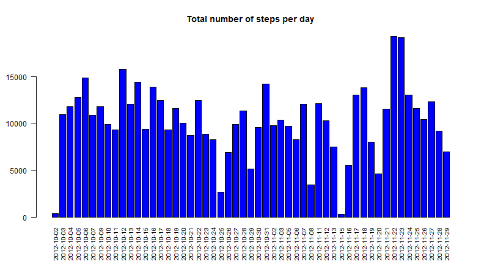
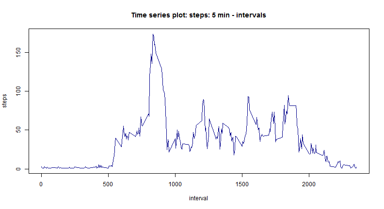
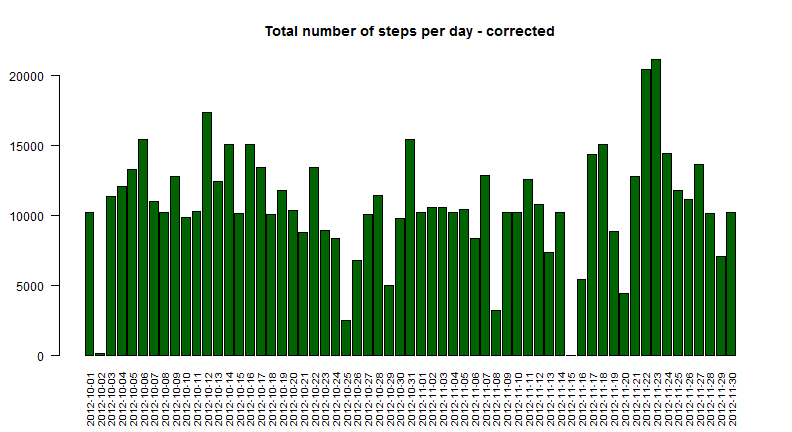
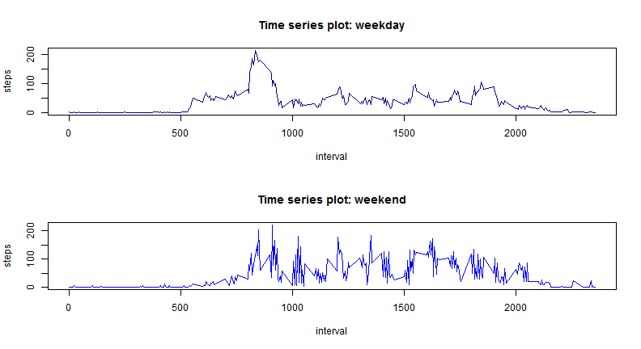

Reproducible Research - Assignment 1 / Kristina Gagalova - VU Amsterdam
========================================================

1) **Loading and preprocessing the data**

```r
act <- read.csv("activity.csv",header=T)
#length(unique(act$date)) #preliminary analysis of how many date are avalable for the plotting
apply(act,2,class) #check what kind of data are in the table
```

```
##       steps        date    interval 
## "character" "character" "character"
```

```r
#processing data 
act$steps<-as.numeric(as.factor(act$steps)) 
act$date<-as.factor(act$date)
```

2) **What is mean total number of steps taken per day?**
- Make a histogram of the total number of steps taken each day

```r
val<-aggregate(steps ~ date, data=act, FUN=sum) #calculate the sum of steps by date
barplot(val$steps,names.arg=val$date,las=2,cex.names=0.8,col="blue",main="Total number of steps per day") #diplay output
```

 

- Calculate and report the mean and median total number of steps taken per day

```r
mean(val$steps)
```

```
## [1] 10223
```

```r
median(val$steps)
```

```
## [1] 10360
```

The median and the mean number of steps per each day is respectively 10223 and 10360. 

3) **What is the average daily activity pattern?**

- Make a time series plot (i.e. type = "l") of the 5-minute interval (x-axis) and the average number of steps taken, averaged across all days (y-axis)


```r
val1<-aggregate(steps ~ interval, data=act, FUN=mean) #calculate teh sum of steps by date
plot(val1$interval,val1$steps,type="l",xlab="interval",ylab="steps",col="dark blue",main="Time series plot: steps: 5 min - intervals")
```

 
- Which 5-minute interval, on average across all the days in the dataset, contains the maximum number of steps?

```r
val1[which.max(val1$steps),]
```

```
##     interval    steps
## 104      835 174.0755
```
The interval with the highest himber of steps is the 835 interval. 

4) **Imputing missing values**

Note that there are a number of days/intervals where there are missing values (coded as NA). The presence of missing days may introduce bias into some calculations or summaries of the data.

- Calculate and report the total number of missing values in the dataset (i.e. the total number of rows with NAs)

```r
sapply(act, function(x) sum(is.na(x)))
```

```
##    steps     date interval 
##     2304        0        0
```
There are 2304 rows with missing values in the steps data. 

- Devise a strategy for filling in all of the missing values in the dataset. The strategy does not need to be sophisticated. For example, you could use the mean/median for that day, or the mean for that 5-minute interval, etc.

The strategy involves the mean calculated per interval. Considering the barplot generated at the point 2 and the time series plot in step 3 it is possible to observe how different are the values per interval. Those calculated per day show a less variegated scenario. The mean steps value per interval was chosen in order to reflect a more reliable experimental analysis

- Create a new dataset that is equal to the original dataset but with the missing data filled in.


```r
#Find the indexes of the NA vaues in the steps column
mis<-which(is.na(act$steps))

#the function replaces the NA values with the mean per interval found in the val1 data frame
replaceNA<-function(val){
  replaced<-c()
  for(i in val){
      #act$steps[i]<-val1[which(val1$interval==act$interval[i]),2]
       replaced<-c(replaced,val1[which(val1$interval==act$interval[i]),2])
  }
  return(replaced)
}

#execute replacement
new<-replaceNA(mis)
act1 <- read.csv("D:/Documenti/Kappa/ReprDataAnAssignment1/activity.csv")
act1[mis,1]<-new #act contains the replaced values 
```
- Make a histogram of the total number of steps taken each day and Calculate and report the mean and median total number of steps taken per day. Do these values differ from the estimates from the first part of the assignment? What is the impact of imputing missing data on the estimates of the total daily number of steps?


```r
valR<-aggregate(steps ~ date, data=act1, FUN=sum) #calculate the sum of steps by date
barplot(valR$steps,names.arg=valR$date,las=2,cex.names=0.8,col="dark green",main="Total number of steps per day - corrected") #diplay output
```

 

```r
mean(valR$steps)
```

```
## [1] 10694.95
```

```r
median(valR$steps)
```

```
## [1] 10395
```
The the data before show that the values per date are changed, also visually comparing the two barplots. The plot at the point 4 shows a significant increase of the 2012-10-01 date which is completely absent in the bxplot at point 2. 
The input if missing values is always an important task which has to be carefully carried out in order to reach a more reliable results. The NA values are usually submitted to replacement for gaining more information from the available data set. In this case 2304 values on 17568 were replaced, giving a significative improvement of the activity monitoring data.


5) **Are there differences in activity patterns between weekdays and weekends?**

- Create a new factor variable in the dataset with two levels - "weekday" and "weekend" indicating whether a given date is a weekday or weekend day.


```r
days<-as.character(act1$date) #transform days to character
newDays<-weekdays(as.Date(days)) #transform dates to days !!!! Sorry for inconveniance but OS is in Italian 
w<-ifelse(newDays == c("sabato","domenica"), "weekend","weekday") #transform to 2 classes
act1$week<-w
```
- Make a panel plot containing a time series plot (i.e. type = "l") of the 5-minute interval (x-axis) and the average number of steps taken, averaged across all weekday days or weekend days (y-axis). The plot should look something like the following, which was creating using simulated data.


```r
weekday<-subset(act1,week=="weekday")
weekend<-subset(act1,week=="weekend")


valWD<-aggregate(steps ~ interval, data=weekday, FUN=mean)
valWE<-aggregate(steps ~ interval, data=weekend, FUN=mean)

par(mfrow=c(2,1))
plot(valWD$interval,valWD$steps,type="l",xlab="interval",ylab="steps",col="dark blue",main="Time series plot: weekday")
plot(valWE$interval,valWE$steps,type="l",xlab="interval",ylab="steps",col="blue",main="Time series plot: weekend")
```

 

The difference between the weekdays and the weekend are easily detectable. The interval 1000-2000 in the weekends shows a more more spiking behavior: several steps picks higher than 100 are observable while the weekday profile is less irregular, even if showing different picks. 
